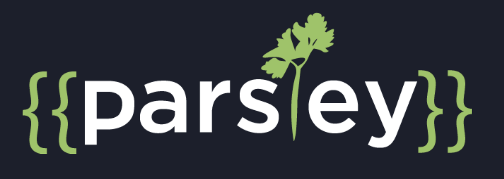

# Parsley - A Content Programming Language

Parsley is a programming language for injecting Zesty.io CMS data into documents. The Parsley language can manipulate documents with string injection, logic, and iteration based on content it can access through a Zesty.io content instance. Parsley is maintained by Zesty.io, a content management system. Zesty.io uses Parsley to render dynamic server side into static files.  

This repo maintains grammers, REPL, and tooling to support the Parsley Syntax and Language. Anyone may contribute to it. Discover Parsley at https://parsley.zesty.io

## Repo Legend

* `/pvl/` - Parsley Visual Layout Tool - A Drag n Drop Layout tool built in react to output parsley code [link](pvl/)
* `/grammers/` - Parsley Grammer files for syntax highlighting in Programming IDEs
* `/repl/` - Tooling to support the learning REPL at https://parsley.zesty.io